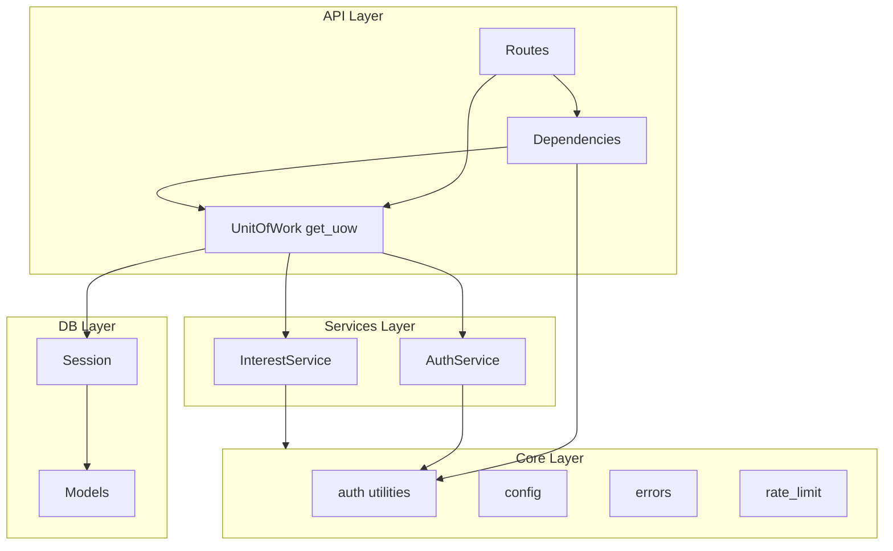

# ai-newsletter-api (backend MVP)

[](https://github.com/bmalott-projects/ai-newsletter-api/actions/workflows/ci-pr.yml)
[](https://github.com/bmalott-projects/ai-newsletter-api/actions/workflows/ci-main.yml)

FastAPI backend for an LLM-driven tech newsletter app.

- keep business logic out of routes
- treat LLM calls as _stateless, schema-validated functions_
- persist content history so newsletters don’t repeat

## Architecture (high level)

Flutter client talks only to this API.

- **`app/api/`**: HTTP layer (FastAPI routers). Thin: validation + JWT auth + calls services. Request-scoped wiring (e.g. Unit of Work, `get_current_user`) lives in `app/api/dependencies/`.
- **`app/services/`**: Domain-specific business logic (user operations, interest extraction, newsletter generation). Contains business rules and orchestrates components.
- **`app/llm/`**: LLM client abstraction + prompts + output schemas (mockable for tests).
- **`app/core/`**: Infrastructure and cross-cutting utilities (configuration, logging, lifespan, password hashing, JWT tokens). Low-level utilities with no business rules. Core does not depend on services or API.
- **`app/db/`**: SQLAlchemy models + session management.
- **`alembic/`**: migrations (DB schema is migration-first).
- **`tests/`**: API + service tests + (later) prompt regression tests.

### Layered architecture

Dependencies are unidirectional: API may depend on core, services, and db; services may depend on core; core does not depend on services or API. Logic and data flow go API → services → DB (wiring can use multiple layers; business logic and queries must not bypass the services layer). See PROJECT_CONTEXT.md for the full diagram and dependency rules.



### Core vs Services Layer

**Core (`app/core/`)**: Infrastructure utilities used across the app

- No business rules, just tools (e.g., `get_password_hash()`, `create_access_token()`)
- Cross-cutting concerns (config, logging, auth primitives)

**Services (`app/services/`)**: Domain business logic

- Contains business rules (e.g., "can't register duplicate emails")
- Orchestrates core utilities + DB + LLM to accomplish domain tasks
- Services use Core utilities (e.g., `register_user()` calls `get_password_hash()`)

## Tech Stack

- **FastAPI**: fast iteration, great Pydantic integration, async-first.
- **Pydantic v2 + pydantic-settings**: strict schemas, structured config from env, guardrails for LLM outputs.
- **JWT authentication**: python-jose for JWT tokens, passlib for password hashing (stateless auth).
- **OpenAI SDK**: LLM client for interest extraction and newsletter generation.
- **SQLAlchemy 2 (async) + asyncpg**: production-grade Postgres support with modern typed ORM.
- **Alembic**: migrations are the source of truth for schema (required once you add pgvector columns/indexes).
- **pgvector (library) + Postgres pgvector extension**: enables embedding similarity for deduplication without introducing a separate vector DB in the MVP.
- **pytest + httpx**: fast API tests
- **ruff + basedpyright**: quick linting + type checks to keep the codebase maintainable.

## Local setup

### 1) Create environment variables

This workspace blocks committing dotfiles like `.env.example`, so use `env.example`:

```zsh
cp env.example .env
```

Your `.env` contains both **app settings** and **Postgres credentials** for Docker Compose.

### 2) Install Python dependencies

Use any workflow you like. With `pip`:

```zsh
python3 -m venv .venv
source .venv/bin/activate
pip install -U pip
pip install -e ".[dev]"
```

### 3) Start DB in Docker

```zsh
docker compose -f docker-compose.local.yml up -d db
```

### 4) Run API locally (debugging)

```zsh
uvicorn app.main:app --host 0.0.0.0 --port 8000 --reload
```

### 5) Start both DB and API in Docker (Development)

For local development with live reloading:

```zsh
docker compose -f docker-compose.local.yml --profile api up -d --build
```

This configuration includes:

- Volume mounts for live code changes
- `--reload` flag for automatic server restart on file changes
- PYTHONPATH override to import from mounted volume

### 6) Start both DB and API in Docker (Production)

For production deployment:

```zsh
docker compose -f docker-compose.prod.yml --profile api up -d --build
```

### 7) Stop services

```zsh
# Stop dev services
docker compose -f docker-compose.local.yml --profile api down

# Stop prod services
docker compose -f docker-compose.prod.yml --profile api down
```

### 8) Run database migrations

Create a new migration (after modifying models):

```zsh
alembic revision --autogenerate -m "description"
```

Apply migrations:

```zsh
alembic upgrade head
```

Downgrade one migration:

```zsh
alembic downgrade -1
```

### 9) Run tests

```zsh
pytest
```
